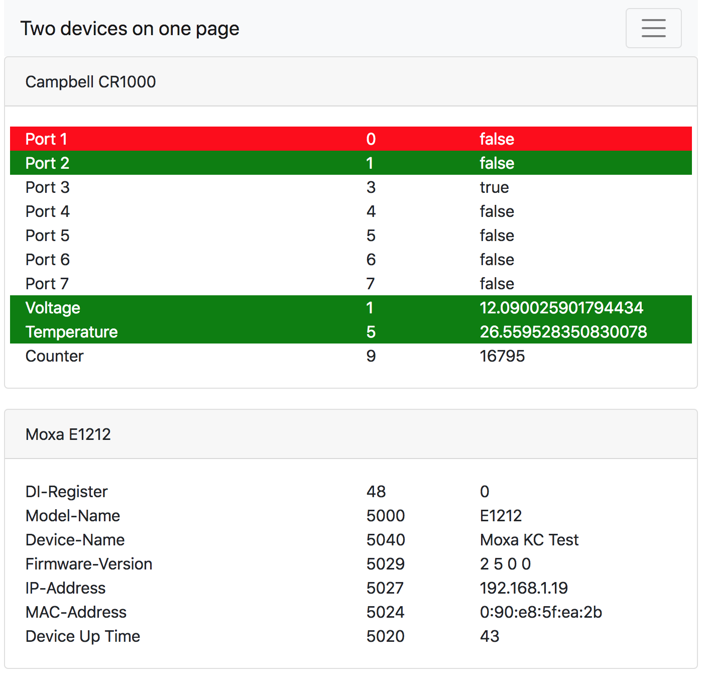

# Modbus Web Client

This is a Modbus client collecting data from several Modbus servers and visualizing them in a simple web app.

The tool is written in JavaScript using node.js, the client uses vue.js.

## Development status

The tool is currently under development, I'll add the features I need for myself. Feel free to ask for (or even better add) features you need. See the [Release Notes](./CHANGELOG.md) for the latest changes.

## Installation

See the [installation](./docs/installation.md) page for more details.

## Configuration and Options

The configuration with all devices is found in a json file. See the config folder of this project for some samples.

You find all options for this file in the [configuration](./docs/configuration.md) manual.

## Start from command line

Create your settings file as described [here](./docs/configuration.md), then pass it as parameter to the app:

    node server.js --config settings.json 

## Start as service

I recommend [PM2](http://pm2.keymetrics.io/) when modbus-client should be run as service. Use [modbus-client-pm2.json](./modbus-client-pm2.json) as template for your configuration.

## Licence

[MIT](./LICENSE)

## Contact
Christian Kuster, CH-8342 Wernetshausen
[www.ancasicolica.ch](http://www.ancasicolica.ch)